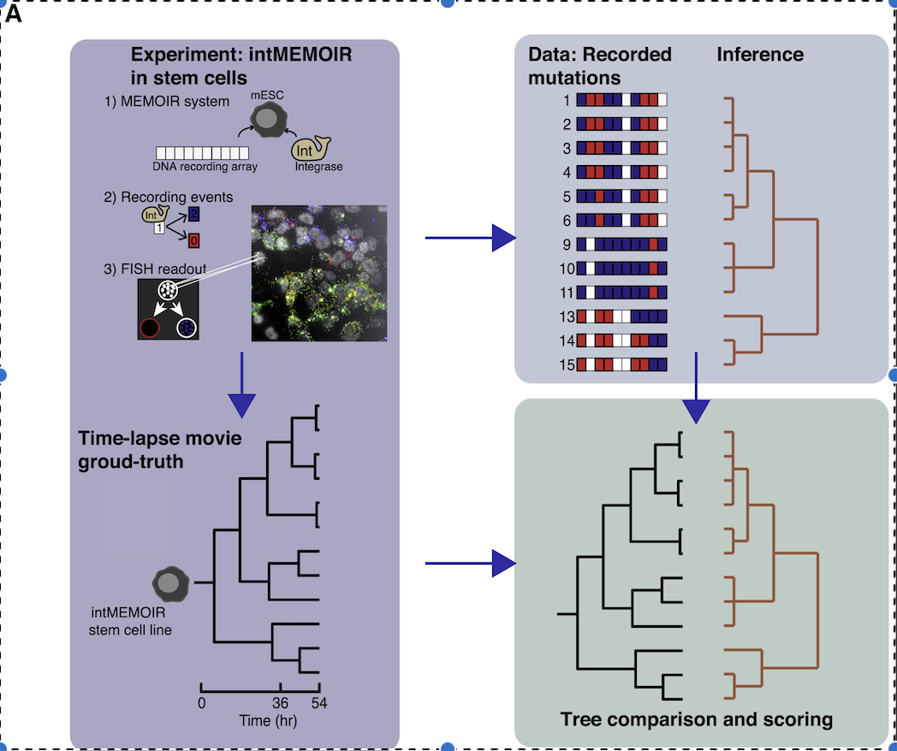
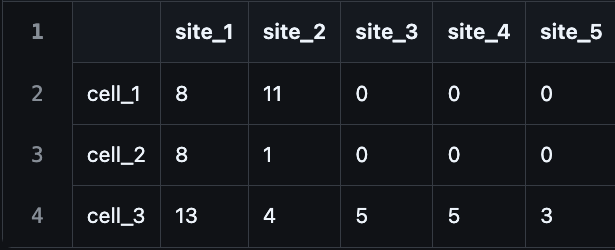

# Background

Understanding how cells divide, differentiate, and die over time is central to developmental biology and cancer research. Recent advances in single-cell lineage recording allow us to track cell histories —but inferring developmental dynamics from these data requires statistical tools  .

TiDeTree  is a BEAST 2 package designed for statistical inference from such single-cell recodring data. It jointly infers time-scaled cell phylogenies and editing model parameters, including editing rates (analogous to molecular clock rates) and the probabilities of different editing outcomes. Beyond tree reconstruction, TiDeTree enables the inference of cell population dynamics, such as cell division, death and differentiation rates.

This tutorial will guide you through the setup and application of TiDeTree using an example dataset. You will learn how to model the editing process, reconstruct timed cell phylogenies, and estimate parameters describing the underlying cellular dynamics.

----

# Programs used in this Exercise

### BEAST2 - Bayesian Evolutionary Analysis Sampling Trees 2

BEAST2 ([http://www.beast2.org](http://www.beast2.org)) is a free software package for Bayesian evolutionary analysis of molecular sequences using MCMC and strictly oriented toward inference using rooted, time-measured phylogenetic trees. This tutorial is written for BEAST v{{ page.beastversion }} .

### BEAUti2 - Bayesian Evolutionary Analysis Utility

BEAUti2 is a graphical user interface tool for generating BEAST2 XML configuration files.

Both BEAST2 and BEAUti2 are Java programs, which means that the exact same code runs on all platforms. For us it simply means that the interface will be the same on all platforms. The screenshots used in this tutorial are taken on a Mac OS X computer; however, both programs will have the same layout and functionality on both Windows and Linux. BEAUti2 is provided as a part of the BEAST2 package so you do not need to install it separately.

### TreeAnnotator

TreeAnnotator is used to produce a summary tree from the posterior sample of trees using one of the available algorithms. It can also be used to summarise and visualise the posterior estimates of other tree parameters (e.g. node height).

TreeAnnotator is provided as a part of the BEAST2 package so you do not need to install it separately.

### Tracer

Tracer ([http://tree.bio.ed.ac.uk/software/tracer](http://tree.bio.ed.ac.uk/software/tracer)) is used to summarise the posterior estimates of the various parameters sampled by the Markov Chain. This program can be used for visual inspection and to assess convergence. It helps to quickly view median estimates and 95% highest posterior density intervals of the parameters, and calculates the effective sample sizes (ESS) of parameters. It can also be used to investigate potential parameter correlations. We will be using Tracer v{{ page.tracerversion }}.

### FigTree

FigTree ([http://tree.bio.ed.ac.uk/software/figtree](http://tree.bio.ed.ac.uk/software/figtree)) is a program for viewing trees and producing publication-quality figures. It can interpret the node-annotations created on the summary trees by TreeAnnotator, allowing the user to display node-based statistics (e.g. posterior probabilities). We will be using FigTree v{{ page.figtreeversion }}.

----

# TiDeTree Installation

TiDeTree can be easily installed via the BEAUti package manager. To do this, open BEAUti and go to the “File” menu and click on “Manage packages”:

<figure>
    <!--a id="fig:beauti"></a-->
    
    <figcaption></figcaption>
</figure>

Then scroll down, highlight the TiDeTree package and click on the “Install/Upgrade” button:

<figure>
    <!--a id="fig:download"></a-->
    
    <figcaption></figcaption>
</figure>

That’s it—TiDeTree is now ready to use! To ensure the package loads properly, restart BEAUti before continuing.

# Practical: TiDeTree Tutorial

In this tutorial, we will estimate editing rates and edit outcome probabilties, effective net growth rates using TiDeTree.

The aim is to:
- Learn how to infer time-scaled trees from single-cell lineage recording data
- Get to know how to choose the set-up of such an analysis
- Learn how to read the output of a TiDeTree analysis

## The Data

In this tutorial, we’ll work with a dataset where a single mouse embryonic stem cell was grown in vitro for 54 hours to form a colony . Actually, we have data from 106 such colonies! At the end of the experiment, a colony contains between 3 and 39 cells, and we have alignments for all of them. However, in this tutorial we will work with a subset of 10 colonies to keep our analysis manageable.

To understand how the cells divide over time, each colony was lineage traced using the intMEMOIR system. This system uses a barcode made up of 10 target sites that are all unedited (state 0) at the start of the experiment. Each target site can be independently edited by a recombinase. The recombinase can either invert (state 1) or delete (state 2) a site. Thus, over the course of the experiment, cell can acquire editing patterns that allow us to reconstruct their phylogeny. 

<figure>
    <!--a id="fig:download"></a-->
    
    <figcaption></figcaption>
</figure>

### Create the .tidetree input files
Usually BEAST 2 expects an alignment of nucleotides as input. However, our alignment consists of integers, encoding the different editing outcomes (e.g. 0, 1 or 2). To still enable BEAUti to load our data, we have to create .tidetree files (which under the hood make BEAUti use an AlignmentFromNexus importer class that accepts integer values separated by commas).

We provide [a script](https://github.com/seidels/tidetree/tree/main/scripts) to convert standard .csv files into .tidetree files (in NEXUS format). For this tutorial, we will work directly with the .tidetree files.

<figure>
    <!--a id="fig:download"></a-->
    
    <figcaption>Exemplary data input file in csv format, where every cell in the table shows the editing outcome at a specific target site (column) for a given cell (row).</figcaption>
</figure>

TODO Q: What does the entry "0" in cell 2 at site 4 stand for?

## Setting up the analysis in BEAUti

At the start, we load the TiDeTree template by selecting File -> Template -> TiDeTree.

### Loading sequence data
To load the data, select File->Import Alignment and navigate to the directory containing the tutorial data. This directory contains 10 .tidetree files, each containing the data for a colony. Since the directory contains only these files and nothing else, we can select them all simply using Ctrl+A (or Command+A on a Mac) and then press "Open".

<figure>
    <!--a id="fig:download"></a-->
    
    <figcaption></figcaption>
</figure>

Now you should see 10 new records—one for each alignment—listed in BEAUti. By default, BEAUti treats each dataset independently, assigning separate site, clock, and tree models to each one. However, since all our data was generated under the same experimental conditions, it makes sense to assume that the editing process was governed by the same parameters across datasets.

To reflect this, we’ll link the Clock Models and Site Models across the datasets. This means that instead of estimating separate parameters for each alignment, BEAST 2 will infer a single, shared set of parameters for the editing process.

To do so, click on one row and then press Ctrl+A, or Command+A on a Mac to select all alignments. Then, press the "Link Site Models" and "Link Clock Models" buttons.

<figure>
    <!--a id="fig:download"></a-->
    
    <figcaption></figcaption>
</figure>

TODO Q: When we link models like this, we’re essentially pooling information to estimate shared parameters. Can you identify which specific parameters are estimated jointly when we link the Clock Models and the Site Models, respectively?

### Specify the sampling times
The data that we’ve loaded was sampled contemporaneously. We can therefore ignore the Tip Dates panel. When analyzing data where the samples were collected at very different times you’ll want to include those times in the analysis by modifying the contents of that panel.

### Specify the Site Model
Next, navigate to the *Site Model* tab. As you have loaded the TiDeTree template, BEAUti directly provides you with the TiDeTree Substitution Model.

We keep the "Gamma Category Count" set at 0, which means that we are not modelling site heterogeneity. Further below, you can see the parameters of the substition model. The "Edit Rates" are initialised and set to be estimated. Based on the .tidetree files, BEAUti correctly detected that there are 2 edit outcomes and therefore initialised a vector with 2 elements.

You’ll also see the Silencing Rate parameter, which models the possibility that certain barcode targets become progressively and irreversibly silenced—preventing their detection through single-cell RNA sequencing. In our dataset, no silencing was observed, so we set the value to 0.0 and uncheck the estimate box. Lastly, we set the Edit Height and Edit Duration to 54, since editing was active for the entire duration of the experiment (54 hours).

<figure>
    <!--a id="fig:download"></a-->
    
    <figcaption></figcaption>
</figure>

TODO Q: Why do may we want to allow for variable edit rates?

### Set the clock model
Now, we move to the *Clock Model* tab. For this relatively short experiment, we assume that the rate of editing did not change. Thus, we keep the "Strict Clock"

<figure>
    <!--a id="fig:download"></a-->
    
    <figcaption></figcaption>
</figure>

TODO Q: All our tips are sampled contemporaneously here. Why can we still estimate the clock rate?

### Initialization
Next, we come to the parameter initialization tab. Here, we will initialise the tree and experiment length for every alignment. This is also a great example of a step that’s much easier to edit directly in the XML—consider this your gentle nudge to get comfortable with a bit of XML hacking! ;)

We'll initialise the tree using a custom starting tree class. The key idea is to ensure that the tree fits within the timeframe of the experiment and does not have a 0 likelihood. By setting the root height close to the total duration (e.g., 53 hours for a 54-hour experiment), and matching the editing height and editing duration, we ensure that the tree has a positive likelihood.

So, go ahead and set the root height, editing height, and editing duration to 53 for all trees for alignments.

<figure>
    <!--a id="fig:download"></a-->
    
    <figcaption></figcaption>
</figure>

Further, we will set every experiment length to 54 hours and uncheck the "estimate" mark because we do not want to estimate it.

<figure>
    <!--a id="fig:download"></a-->
    
    <figcaption></figcaption>
</figure>

Finally, we also want to set the initial value of the effective birth rate to 0.05, such that it is contained within the prior distribution we will set up next.

<figure>
    <!--a id="fig:download"></a-->
    
    <figcaption></figcaption>
</figure>

### Set priors
Now, we want to set the priors for the parameters of our model under the *Priors* tab.

We'll start by choosing the phylodynamic model that describes how the trees were generated. Given the small size of the cell population (4 − 40 cells), we expect the population growth process to be highly stochastic. The birth-death-sampling model can account for these stochastic fluctuations.

In BEAUti, you'll notice that a separate prior is defined for every tree. Since all colonies were grown under the same experimental conditions, we want them to share the same birth and death rate parameters. Unfortunately, BEAUti doesn’t currently support linking these priors directly through the interface. So we will first create an xml with separate parameters for each colony, and in a second step link the parameters by editing the XML and see how the runs compare.

TODO Q: How do you expect the runs to differ?

<figure>
    <!--a id="fig:download"></a-->
    
    <figcaption></figcaption>
</figure>

So, for each alignment, we pick "Birth-death model" from the drop-down menu. Then, we specify the effective birth rate of the Birth-death model, which is the cell division minus the cell death rate. We pick a Uniform prior over [0, 0.1]. This reflects our expectation that the total number of cells remains below 220 at the end of the experiment (after 54 h). 

<figure>
    <!--a id="fig:download"></a-->
    
    <figcaption></figcaption>
</figure>

Additionally, we place a Uniform prior over [0, 1] on the relative death rate or cell turnover (death rate / birth rate), stating that we expect the birth rate to be larger than the death rate.

<figure>
    <!--a id="fig:download"></a-->
    
    <figcaption></figcaption>
</figure>

Then we place a lognormal prior with mean -5 and sd 1 on the clock rate, which translates to us expecting between 1 to 10 edits to occur over 54 hours. We keep the Dirichlet prior on the edit probabilities.

<figure>
    <!--a id="fig:download"></a-->
    
    <figcaption></figcaption>
</figure>

Here's a snapshot of how your overall prior tab should now look like.

<figure>
    <!--a id="fig:download"></a-->
    
    <figcaption></figcaption>
</figure>

### MCMC

Finally, set the **chain length** to `10^6` and the **sampling interval** to `10^3` under the *MCMC* tab. 

Once your analysis is fully set up, go to **File → Save**, navigate to your desired directory, and save the BEAST input file with a clear and descriptive name—e.g., `tidetree_tutorial.xml`.

<figure>
    <!--a id="fig:download"></a-->
    
    <figcaption></figcaption>
</figure>

 **Tip:** If BEAUti gives you trouble when generating the XML file and you’d like to proceed with the analysis right away, you can also download and use a pre-made XML file [link](https://github.com/seidels/TiDeTree-Tutorial/tree/master/precooked_runs/tutorial-unlinked-birth-death.xml).

### 

### TODOs
Add starting tree class with edit height
add clock priors
add silencing rate plus prior, operator etc.
set origin
Make sure the correct number of edit probabilities is appearing and the Sci Phy Substmodel is changed in BEAUTI!!

----

# Useful Links

- [Bayesian Evolutionary Analysis with BEAST 2](http://www.beast2.org/book.html) 
- BEAST 2 website and documentation: [http://www.beast2.org/](http://www.beast2.org/)
- BEAST 1 website and documentation: [http://beast.bio.ed.ac.uk](http://beast.bio.ed.ac.uk)
- Join the BEAST user discussion: [http://groups.google.com/group/beast-users](http://groups.google.com/group/beast-users) 

----

# Relevant References



