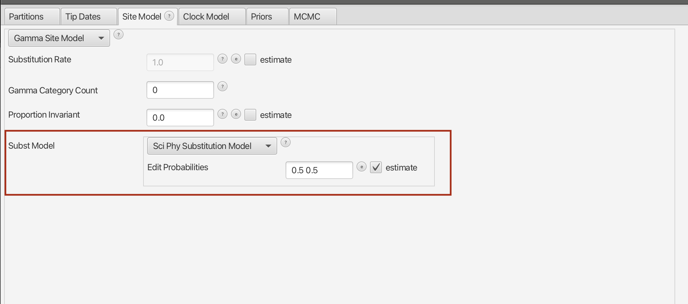
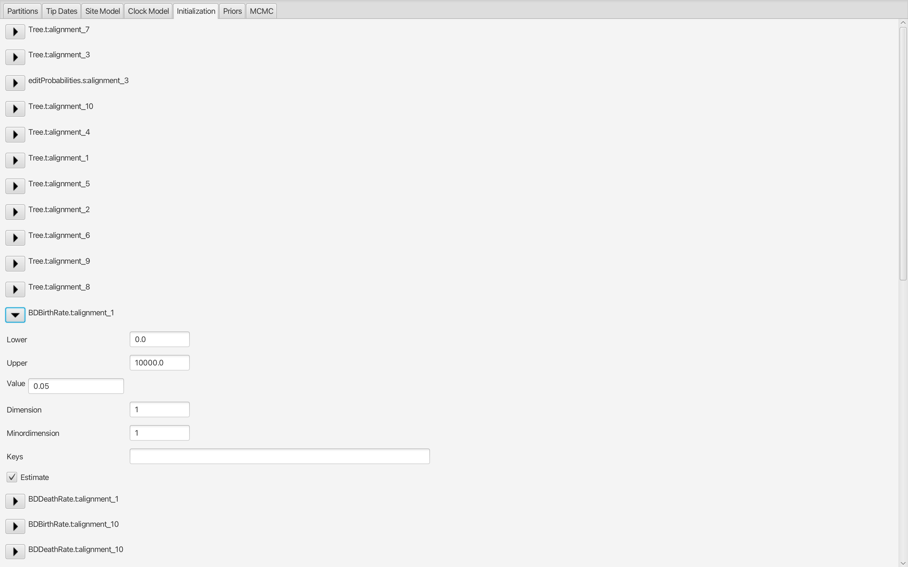
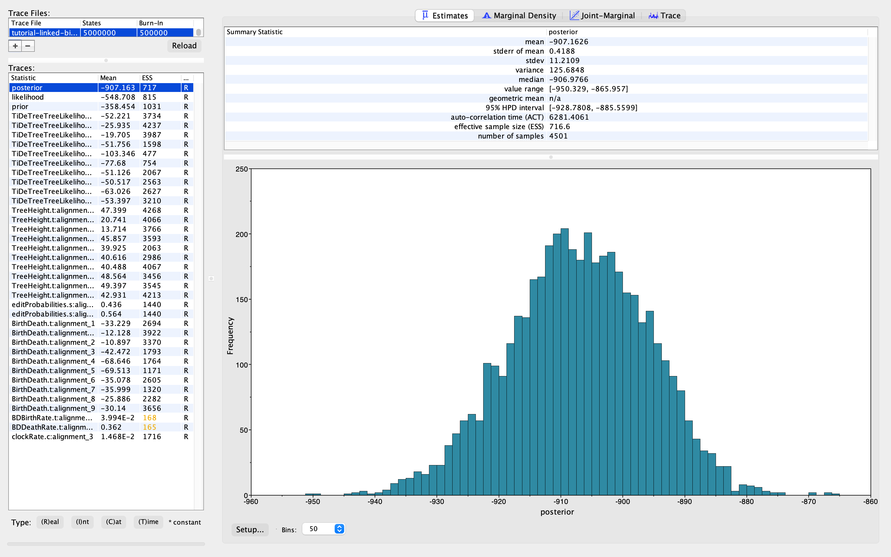

# Background

Understanding how cells divide, differentiate, and die over time is central to developmental biology and cancer research. Recent advances in single-cell lineage recording allow us to track cell histories —but inferring developmental dynamics from these data requires statistical tools .

TiDeTree  is a BEAST 2 package designed for statistical inference from such single-cell recording data. It jointly infers time-scaled single-cell phylogenies and editing model parameters, including editing rates (analogous to molecular clock rates) and the probabilities of different editing outcomes. Beyond tree reconstruction, TiDeTree enables the inference of cell population dynamics, such as cell division, death and differentiation rates.

This tutorial will guide you through the setup and application of TiDeTree using an example dataset. You will learn how to model the editing process, reconstruct timed cell phylogenies, and estimate parameters describing the underlying cellular dynamics.

----

# Programs used in this Exercise

### BEAST2 - Bayesian Evolutionary Analysis Sampling Trees 2

BEAST2 ([http://www.beast2.org](http://www.beast2.org)) is a free software package for Bayesian evolutionary analysis of molecular sequences using MCMC and strictly oriented toward inference using rooted, time-measured phylogenetic trees. This tutorial is written for BEAST v{{ page.beastversion }} .

### BEAUti2 - Bayesian Evolutionary Analysis Utility

BEAUti2 is a graphical user interface tool for generating BEAST2 XML configuration files.

Both BEAST2 and BEAUti2 are Java programs, which means that the exact same code runs on all platforms. For us it simply means that the interface will be the same on all platforms. The screenshots used in this tutorial are taken on a Mac OS X computer; however, both programs will have the same layout and functionality on both Windows and Linux. BEAUti2 is provided as a part of the BEAST2 package so you do not need to install it separately.

### TreeAnnotator

TreeAnnotator is used to produce a summary tree from the posterior sample of trees using one of the available algorithms. It can also be used to summarise and visualise the posterior estimates of other tree parameters (e.g. node height).

TreeAnnotator is provided as a part of the BEAST2 package so you do not need to install it separately.

### Tracer

Tracer ([http://tree.bio.ed.ac.uk/software/tracer](http://tree.bio.ed.ac.uk/software/tracer)) is used to summarise the posterior estimates of the various parameters sampled by the Markov Chain. This program can be used for visual inspection and to assess convergence. It helps to quickly view median estimates and 95% highest posterior density intervals of the parameters, and calculates the effective sample sizes (ESS) of parameters. It can also be used to investigate potential parameter correlations. We will be using Tracer v{{ page.tracerversion }}.

### FigTree

FigTree ([http://tree.bio.ed.ac.uk/software/figtree](http://tree.bio.ed.ac.uk/software/figtree)) is a program for viewing trees and producing publication-quality figures. It can interpret the node-annotations created on the summary trees by TreeAnnotator, allowing the user to display node-based statistics (e.g. posterior probabilities). We will be using FigTree v{{ page.figtreeversion }}.

----

# Practical: TiDeTree Tutorial

In this tutorial, we will estimate editing rates and edit outcome probabilities, effective net growth rates using TiDeTree.

The aim is to:
- Learn how to infer time-scaled trees from single-cell lineage recording data
- Get to know how to choose the set-up of such an analysis
- Learn how to read the output of a TiDeTree analysis

## TiDeTree Installation

TiDeTree can be easily installed via the BEAUti package manager. 

> Start **BEAUti** then open the **BEAST2 Package Manager** by navigating to **File > Manage Packages**.
> 

<figure>
    <!--a id="fig:beauti"></a-->
    
    <figcaption>Figure 1: Finding the BEAST2 Package Manager </figcaption>
</figure>

> Then scroll down, highlight the **TiDeTree package** and click on the **Install/Upgrade** button.

<figure>
    <!--a id="fig:download"></a-->
    
    <figcaption>Figure 2:  Installing TiDeTree via the Package Manager</figcaption>
</figure>

> Close the **BEAST2 Package Manager** and _**restart**_ BEAUti to fully load the **TiDeTree** package.

That’s it—TiDeTree is now ready to use! 

## Setting up the analysis in BEAUti

At the start, we load the TiDeTree template by selecting **File > Template > tidetree**.

### Loading sequence data
To load the data, select **File > Add Alignment** and navigate to the directory containing the tutorial data. This directory contains 10 `.tidetree` files, each containing the data for a colony. Since the directory contains only these files and nothing else, we can select them all simply using Ctrl+A (or Command+A on a Mac) and then press "Open".

<figure>
    <!--a id="fig:download"></a-->
    
    <figcaption>Figure 3: Importing the alignments into BEAUTI. </figcaption>
</figure>

Now you should see 10 new records—one for each alignment—listed in BEAUti. By default, BEAUti treats each dataset independently, assigning separate site, clock, and tree models to each one. However, since all our data was generated under the same experimental conditions, it makes sense to assume that the editing process was governed by the same parameters across datasets.

To reflect this, we’ll link the Clock Models and Site Models across the datasets. This means that instead of estimating separate parameters for each alignment, BEAST 2 will infer a single, shared set of parameters for the editing process.

To do so, click on one row and then press Ctrl+A, or Command+A on a Mac to select all alignments. Then, press the "Link Site Models" and "Link Clock Models" buttons.

<figure>
    <!--a id="fig:download"></a-->
    
    <figcaption>Figure 4: Linked clock and site models.</figcaption>
</figure>

> **Topic for discussion**
> When we link models like this, we’re essentially pooling information to estimate shared parameters. Can you identify which specific parameters are estimated jointly when we link the Clock Models and the Site Models, respectively?
>

### Specify the sampling times
The data that we’ve loaded was sampled contemporaneously and we do not need to specify the sampling times per se. However, in order to estimate the clock rate, we have to specify them as "Use tip dates" and select the dates as "Since some time in the past". 

<figure>
    <!--a id="fig:download"></a-->
    
    <figcaption>Figure 5: Tip dates panel setup</figcaption>
</figure>

### Specify the Site Model
Next, navigate to the *Site Model* tab. As you have loaded the TiDeTree template, BEAUti directly provides you with the TiDeTree Substitution Model.

We keep the "Gamma Category Count" set at 0, which means that we are not modelling site heterogeneity. Further below, you can see the parameters of the substition model. The "Edit Rates" are initialised and set to be estimated. Based on the `.tidetree` files, BEAUti correctly detected that there are 2 edit outcomes and therefore initialised a vector with 2 elements.

You’ll also see the Silencing Rate parameter, which models the possibility that certain barcode targets become progressively and irreversibly silenced—preventing their detection through single-cell RNA sequencing. In our dataset, no silencing was observed, so we set the value to 0.0 and uncheck the estimate box. Lastly, we set the Edit Height and Edit Duration to 54, since editing was active for the entire duration of the experiment (54 hours).

<figure>
    <!--a id="fig:download"></a-->
    
    <figcaption>Figure 6: Specifying the substitution model.</figcaption>
</figure>

> **Topic for discussion**
> Do we want to allow for variable edit rates? Why or why not?

### Set the clock model
Now, we move to the *Clock Model* tab. For this relatively short experiment, we assume that the rate of editing did not change. Thus, we keep the "Strict Clock".

<figure>
    <!--a id="fig:download"></a-->
    
    <figcaption>Figure 7: Specifying the site model.</figcaption>
</figure>

> **Topic for discussion**
> All our tips are sampled contemporaneously here. Why can we still estimate the clock rate?

### Initialization
Next, we come to the parameter initialization tab. Here, we will initialise the tree and experiment length for every alignment. This is also a great example of a step that’s much easier to edit directly in the XML file—consider this your gentle nudge to get comfortable with a bit of XML hacking! ;)

We'll initialise the tree using a custom starting tree class. The key idea is to ensure that the tree fits within the timeframe of the experiment and does not have a 0 likelihood. By setting the root height close to the total duration (e.g., 53 hours for a 54-hour experiment), and matching the editing height and editing duration, we ensure that the tree has a positive likelihood.

So, go ahead and set the root height, editing height, and editing duration to 53 for all 10 trees (for the 10 alignments).

<figure>
    <!--a id="fig:download"></a-->
    
    <figcaption>Figure 8: Initialise the starting tree.</figcaption>
</figure>

Further, we will set every experiment length to 54 hours and uncheck the "estimate" mark because we do not want to estimate it.

<figure>
    <!--a id="fig:download"></a-->
    
    <figcaption>Figure 9: Set the experiment duration.</figcaption>
</figure>

### Set priors
Now, we want to set the priors for the parameters of our model under the *Priors* tab.

We'll start by choosing the phylodynamic model that describes how the trees were generated. Given the small size of the cell population (4 − 40 cells), we expect the population growth process to be highly stochastic. The birth-death-sampling model can account for these stochastic fluctuations.

In BEAUti, you'll notice that a separate prior is defined for every tree. Since all colonies were grown under the same experimental conditions, we want them to share the same birth and death rate parameters. Unfortunately, BEAUti doesn’t currently support linking these priors directly through the interface. So we will first create an xml with separate parameters for each colony, and in a second step link the parameters by editing the XML and see how the runs compare.

> **Topic for discussion**
> 
> How do you expect the runs to differ?
>

<figure>
    <!--a id="fig:download"></a-->
    
    <figcaption>Figure 12:</figcaption>
</figure>

So, for each alignment, we pick "Birth-death model" from the drop-down menu. Then, we specify the effective birth rate of the Birth-death model, which is the cell division minus the cell death rate. We pick a Uniform prior over [0, 0.1]. This reflects our expectation that the total number of cells remain below 220 at the end of the experiment (after 54 h). 

<figure>
    <!--a id="fig:download"></a-->
    
    <figcaption>Figure 10: Specify the prior on the effective birth rate. </figcaption>
</figure>

Additionall, we also want to set the initial value of the effective birth rate to 0.05, such that it is contained within the prior distribution just set. So select "initial" and set "Value" to 0.05.

<figure>
    <!--a id="fig:download"></a-->
    
    <figcaption>Figure 11: Set initial value for the effective birth rate.</figcaption>
</figure>

Additionally, we place a Uniform prior over [0, 1] on the relative death rate or cell turnover (death rate / birth rate), stating that we expect the birth rate to be larger than the death rate.

<figure>
    <!--a id="fig:download"></a-->
    
    <figcaption>Figure 11: Specify the prior on the relative death rate.</figcaption>
</figure>

Then we place a lognormal prior with mean -5 and sd 1 on the clock rate, which translates to us expecting between 1 to 10 edits to occur over 54 hours. We keep the Dirichlet prior on the edit probabilities.

<figure>
    <!--a id="fig:download"></a-->
    
    <figcaption>Figure 12: Specify the prior on the clock rate.</figcaption>
</figure>

Here's a snapshot of how your overall prior tab should now look like.

<figure>
    <!--a id="fig:download"></a-->
    
    <figcaption>Figure 13: Specify the prior on the edit probabilities.</figcaption>
</figure>

### MCMC

Under the MCMC tab, set the **chain length** to `5 * 10^6` and the **sampling interval** to `10^3`. Additionally, make sure the tree logs are being written to separate files by renaming them separately for each alignment.

<figure>
    <!--a id="fig:download"></a-->
    
    <figcaption>Figure 15: Specify distinct tree log file names.</figcaption>
</figure>

Once your analysis is fully set up, go to **File → Save**, navigate to your desired directory, and save the BEAST input file with a clear and descriptive name—e.g., `tidetree_tutorial.xml`.

<figure>
    <!--a id="fig:download"></a-->
    
    <figcaption>Figure 14: MCMC setup.</figcaption>
</figure>

 **Tip:** If BEAUti gives you trouble when generating the XML file and you’d like to proceed with the analysis right away, you can also download and use a pre-made XML file [link](https://github.com/seidels/TiDeTree-Tutorial/tree/master/precooked_runs/tutorial-unlinked-birth-death.xml).

### Analyse the data

> Load the tutorial-unlinked-birth-death.log file into Tracer to assess mixing and the parameter estimates.
<figure>
    <!--a id="fig:download"></a-->
    
    <figcaption>Figure 15: Check convergence.</figcaption>
</figure>

All parameters, including the posterior and likelihood, show effective sample sizes (ESS) above 200, indicating good mixing.

Let's inspect the estimated clock rate, representing the rate of introducing an edit at any site in the barcode.

> In Tracer, select **clockRate** and then click on **Marginal Density**.

<figure>
    <!--a id="fig:download"></a-->
    
    <figcaption>Figure 16: Estimated clock rate (edit rate) marginal posterior.</figcaption>
</figure>

We see that the estimated median posterior rate is 0.015 edits per site per hour. Over the 54-hour experiment, this corresponds to 0.8 expected edits per site. 

Now, let's examine the  **effective birth rates**  (net growth rates) per dataset.

> Select **BDBirthRate[1-10]** and then click on **Estimates**.

<figure>
    <!--a id="fig:download"></a-->
    
    <figcaption>Figure 17: Estimated net growth marginal posteriors.</figcaption>
</figure>

Most median estimates fluctuate around 0.04/hour, but the uncertainty is high—for example, the 95% highest posterior density (HPD) interval for alignment 1 ranges from [0.007 to 0.07].

Next, we compare this to the **linked** analysis, where birth and death rates are shared across datasets. We have already prepared the xml and log for you. The key difference is that in our *unlinked* analysis, we estimated a separate birth and death rate for every dataset in every tree prior. In the *linked analysis*, we reference the same birth and death rates across tree priors, essentially pooling them across datasets which we show in the image below.
*(Note: The unlinked analysis requires additional changes to the the XML, e.g., removing now-unnecessary parameter states, which we will not detail here. You’re welcome to explore the differences between the linked and unlinked XML files.)*

<figure>
    <!--a id="fig:download"></a-->
    
    <figcaption>Figure 18: XML hacking to pool birth and death rates across datasets.</figcaption>
</figure>

> Run the pre-made [XML file](https://github.com/seidels/TiDeTree-Tutorial/tree/master/precooked_runs/tutorial-linked-birth-death.xml) or directly load the pre-cooked [log](https://github.com/seidels/TiDeTree-Tutorial/tree/master/precooked_runs/tutorial-linked-birth-death.log) into Tracer.

We can see that all ESS values are above 200 and that the Traces look well mixed, indicating convergence.

<figure>
    <!--a id="fig:download"></a-->
    
    <figcaption>Figure 19: Check convergence.</figcaption>
</figure>

Let us now check the estimated net growth rates.
> Click on BDBirthRate and the Maringal Density Tab.

<figure>
    <!--a id="fig:download"></a-->
    
    <figcaption>Figure 20: Estimated net growth marginal posteriors pooled across alignments.</figcaption>
</figure>

We observe that the uncertainty is reduced, and the 95% HPD interval for the pooled **effective birth rate** is now **[0.02, 0.06]**, which corresponds to **at least 1–4 cell divisions** over the course of the experiment. The *“at least”* reflects that the effective birth rate equals the birth rate minus the death rate, providing a **lower bound** on the total number of divisions. This estimate aligns well with the original publication’s reported range of **3–5 divisions**.

In summary, even though the individual dataset carried limited signal, pooling parameters across alignments allows us to  extract biologically meaningful estimates with reduced uncertainty.

## Tree log visualisation

Next, we want to visualise the trees. Be aware that how much sense it makes to look at the trees depends on the dataset and there very much on the number of sites that are used to trace lineage and how large the tree is that you are trying to estimate (the general data points vs number of parameters question). Remember, in every dataset here we have 10 sites, which is a much lower signal compared to thousands of sites used on applications in epidemiology or macroevolution.

Let us pick dataset 1 to visualuse which has 9 cells. To appreciate how much uncertainty there is in the tree structure, lets plot the tree posterior in Densitree.

> Open DensiTree and load the file tutorial-linked-birth-death.1.trees

<figure>
    <!--a id="fig:download"></a-->
    
    <figcaption>Figure 21: Posterior distribution of trees.</figcaption>
</figure>

You can see that the cherry for cells 6 and 7 is well supported whereas the hierarcy among cells 0-3 has multiple consensus trees that can explain the data.

To summarise the posterior trees, we will use TreeAnnotator and generate two point estimates as you have seen in other tutorials, the maximum clade credibility tree (MCC) and the tree based on the conditional clade distribution (CCD). **To save time, you may run just one method and compare it to the other using the example below.**

## Generating the MCC tree

> Open **TreeAnnotator** and then set the options as in Fig. 22 below. You have to specify the **Burning percentage**, **Target tree type, Node heights, Input Tree File** and the **Output File**. Click **Run** to start the program.

<figure>
    <!--a id="fig:ta-mcc"></a-->
    
    <figcaption>Figure 22: TreeAnnotator settings for MCC tree.</figcaption>
</figure>

## Generating the CCD tree

> Open **TreeAnnotator** and then set the options as in Fig. 23 below. Compared to generting the MCC tree you only have to change the **Target tree type** and the name of the  **Output file**. All other options remain the same. Click **Run** to start the program.

<figure>
    <!--a id="fig:ta-ccd"></a-->
    
    <figcaption>Figure 23: TreeAnnotator settings for CCD tree.</figcaption>
</figure>

## Analyse the summary trees

> Open **FigTree** and load your chosen summary tree.
>
> On the left hand menu, select **Node Labels* and choose to display the **posterior** support at the internal nodes. Increase the Font size until the labels are clearly visible.

> Further, select **Node Bars** and display **height_95%_HPD** to display the 95% HPD for the node heights.
>

<figure>
    <!--a id="fig:ta-ccd"></a-->
    
    <figcaption>Figure 24: TreeAnnotator settings for CCD tree.</figcaption>
</figure>

> **Topic for discussion** How do the posterior node labels compare to the observations we made when analysing the tree posterior in DensiTree?

----

# Useful Links

- [Bayesian Evolutionary Analysis with BEAST 2](http://www.beast2.org/book.html) 
- BEAST 2 website and documentation: [http://www.beast2.org/](http://www.beast2.org/)
- BEAST 1 website and documentation: [http://beast.bio.ed.ac.uk](http://beast.bio.ed.ac.uk)
- Join the BEAST user discussion: [http://groups.google.com/group/beast-users](http://groups.google.com/group/beast-users) 

----

# Relevant References



