# Background

Understanding how cells divide, differentiate, and die over time is central to developmental biology and cancer research. Recent advances in single-cell lineage recording allow us to track cell histories —but inferring developmental dynamics from these data requires statistical tools .

TiDeTree  is a BEAST 2 package designed for statistical inference from such single-cell recording data. It jointly infers time-scaled single-cell phylogenies and editing model parameters, including editing rates (analogous to molecular clock rates) and the probabilities of different editing outcomes. Beyond tree reconstruction, TiDeTree enables the inference of cell population dynamics, such as cell division, death and differentiation rates.

This tutorial will guide you through the setup and application of TiDeTree using an example dataset. You will learn how to model the editing process, reconstruct timed cell phylogenies, and estimate parameters describing the underlying cellular dynamics.

----

# Programs used in this Exercise

### BEAST2 - Bayesian Evolutionary Analysis Sampling Trees 2

BEAST2 ([http://www.beast2.org](http://www.beast2.org)) is a free software package for Bayesian evolutionary analysis of molecular sequences using MCMC and strictly oriented toward inference using rooted, time-measured phylogenetic trees. This tutorial is written for BEAST v{{ page.beastversion }} .

### BEAUti2 - Bayesian Evolutionary Analysis Utility

BEAUti2 is a graphical user interface tool for generating BEAST2 XML configuration files.

Both BEAST2 and BEAUti2 are Java programs, which means that the exact same code runs on all platforms. For us it simply means that the interface will be the same on all platforms. The screenshots used in this tutorial are taken on a Mac OS X computer; however, both programs will have the same layout and functionality on both Windows and Linux. BEAUti2 is provided as a part of the BEAST2 package so you do not need to install it separately.

### TreeAnnotator

TreeAnnotator is used to produce a summary tree from the posterior sample of trees using one of the available algorithms. It can also be used to summarise and visualise the posterior estimates of other tree parameters (e.g. node height).

TreeAnnotator is provided as a part of the BEAST2 package so you do not need to install it separately.

### Tracer

Tracer ([http://tree.bio.ed.ac.uk/software/tracer](http://tree.bio.ed.ac.uk/software/tracer)) is used to summarise the posterior estimates of the various parameters sampled by the Markov Chain. This program can be used for visual inspection and to assess convergence. It helps to quickly view median estimates and 95% highest posterior density intervals of the parameters, and calculates the effective sample sizes (ESS) of parameters. It can also be used to investigate potential parameter correlations. We will be using Tracer v{{ page.tracerversion }}.

### FigTree

FigTree ([http://tree.bio.ed.ac.uk/software/figtree](http://tree.bio.ed.ac.uk/software/figtree)) is a program for viewing trees and producing publication-quality figures. It can interpret the node-annotations created on the summary trees by TreeAnnotator, allowing the user to display node-based statistics (e.g. posterior probabilities). We will be using FigTree v{{ page.figtreeversion }}.

----

# Practical: TiDeTree Tutorial

In this tutorial, we will estimate editing rates and edit outcome probabilities, as well as effective net growth rates using TiDeTree.

The aim is to:
- Learn how to infer time-scaled trees from single-cell lineage recording data
- Get to know how to choose the set-up of such an analysis
- Learn how to read the output of a TiDeTree analysis

## TiDeTree Installation

TiDeTree can be easily installed via the BEAUti package manager. 

> Start **BEAUti** then open the **BEAST2 Package Manager** by navigating to **File > Manage Packages**.
> 
> Then scroll down, highlight the **TiDeTree package** and click on the **Install/Upgrade** button ([Figure 1](#fig:download)).

<figure>
    
    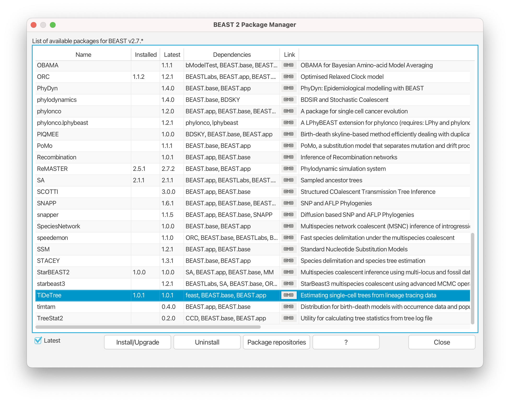
    <figcaption>Figure 1:  Installing TiDeTree via the Package Manager</figcaption>
</figure>

> Close the **BEAST2 Package Manager** and _**restart**_ BEAUti to fully load the **TiDeTree** package.

That’s it—TiDeTree is now ready to use! 

## The Data

In this tutorial, we’ll work with a dataset where a single mouse embryonic stem cell was grown in vitro for 54 hours to form a colony . Actually, we have data from 106 such colonies! At the end of the experiment, a colony contains between 3 and 39 cells, and we have alignments for all of them. However, in this tutorial we will work with a subset of 10 colonies to keep our analysis manageable.

To understand how the cells divide over time, each colony was lineage traced using the intMEMOIR system. This system uses a barcode made up of 10 target sites that are all unedited (state 0) at the start of the experiment. Each target site can be independently edited by a recombinase. The recombinase can either invert (state 1) or delete (state 2) a site. Thus, over the course of the experiment, cells can acquire editing patterns that allow us to reconstruct their phylogeny ([Figure 2](#fig:intMEMOIR)). 

<figure>
    
    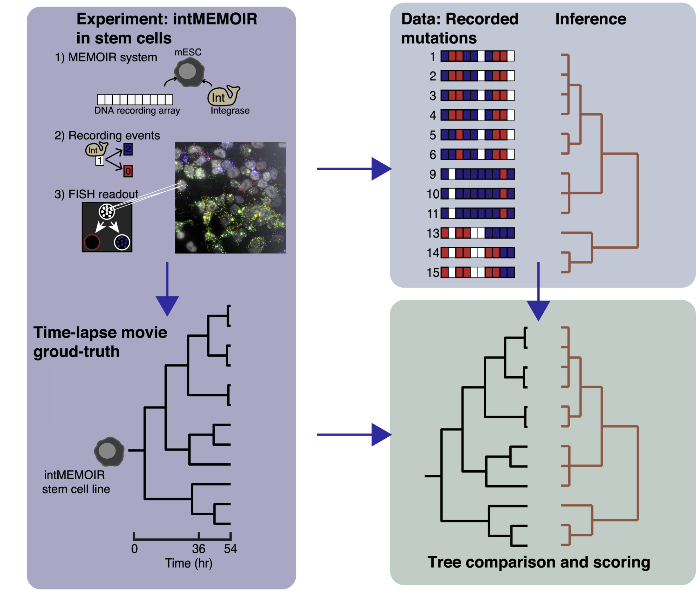
    <figcaption> Figure 2: Setup of intMEMOIR for lineage tracing in stem cells. Adapted from .</figcaption>
</figure>

### Creating `.tidetree` input files
Usually BEAST 2 expects an alignment of nucleotides as input. However, our alignment consists of integers, encoding the different editing outcomes (e.g. 0, 1 or 2). To still enable BEAUti to load our data, we have to create `.tidetree` files (which under the hood make BEAUti use an `AlignmentFromNexus` importer class that accepts integer values separated by commas).

We provide [a script](https://github.com/seidels/tidetree/tree/main/scripts) to convert standard `.csv` files into `.tidetree` files (in NEXUS format). For this tutorial, we will work directly with the `.tidetree` files.

<figure>
    
    
    <figcaption>Figure 3: Example data input file in .csv format, where every cell in the table shows the editing outcome at a specific target site (column) for a given cell (row).</figcaption>
</figure>

> **Topic for discussion**
>
> What does the entry "0" in cell 1 at site 3 stand for?

## Setting up the analysis in BEAUti

We will use BEAUti2 to select the priors and starting values for our analysis and save these settings into a BEAST2 XML file.

> Starting **BEAUti2** and load the TiDeTree template by selecting **File > Template > tidetree**.

### Loading the sequencing data

Next we will load the `.tidetree` input files from the mouse embryonic stem cell experiment.

> To load the data, select **File > Add Alignment** and navigate to the directory containing the tutorial data. This directory contains 10 `.tidetree` files, each containing the data for a colony. Since the directory contains only these files and nothing else, we can select them all simply using **Ctrl+A** (or **Command+A** on a Mac) and then click on **Open**. 
>
> If you are short on time, feel free to only load the first 3 alignments for the purpose of going through the tutorial, because we will have to repeat some steps for each alignment.

Now you should see 10 new records—one for each alignment—listed in BEAUti ([Figure 4](#fig:partitions)).

<figure>
    
    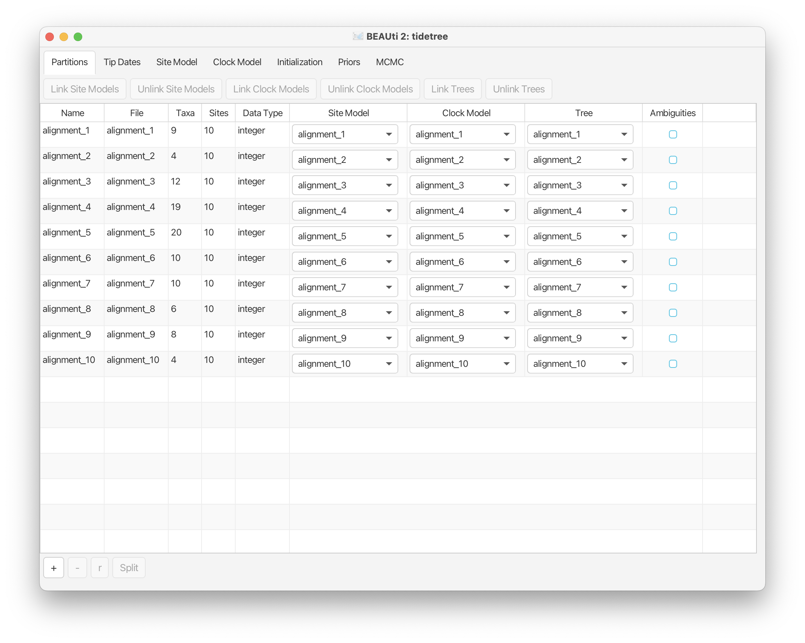
    <figcaption>Figure 4: Importing the alignments into BEAUTI. </figcaption>
</figure>

> Double click on one of the alignments to display its contents ([Figure 5](#fig:alignment-beauti)).

<figure>
    
    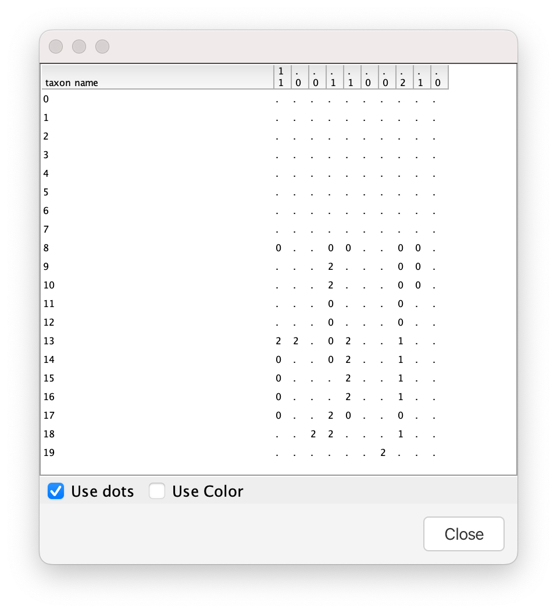
    <figcaption>Figure 5: One of the alignments as displayed in BEAUTI. </figcaption>
</figure>

By default, BEAUti treats each dataset independently, assigning separate site, clock, and tree models to each one. However, since all our data was generated under the same experimental conditions, it makes sense to assume that the editing process was governed by the same parameters across datasets.

To reflect this, we’ll link the Clock Models and Site Models across the datasets. This means that instead of estimating separate parameters for each alignment, BEAST 2 will infer a single, shared set of parameters for the editing process.

> Click on one row and then press **Ctrl+A**, (or **Command+A** on a Mac) to select all alignments. Then, click on **Link Site Models** and **Link Clock Models** ([Figure 6](#fig:linkedmodels)).
>
> Double click on the site model for the first alignment and rename it to **sitemodel**.
>
> Double click on the clock model for the first alignment and rename it to **clockmodel**.

<figure>
    
    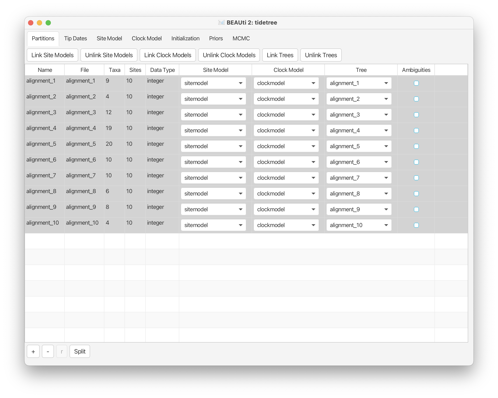
    <figcaption>Figure 6: Linked clock and site models.</figcaption>
</figure>

> **Topic for discussion**
>
> When we link models like this, we’re essentially pooling information to estimate shared parameters. Can you identify which specific parameters are estimated jointly when we link the Clock Models and the Site Models, respectively?
>

### Specifying the sampling times
The data that we’ve loaded was sampled contemporaneously and we do not need to specify the sampling times per se. However, in order to estimate the clock rate, we have to tell BEAST to use the tip dates and to measure them as some time in the past. 

> Navigate to the **Tip Dates** tab. Check the **Use tip dates** box and make sure since **Since some time in the past** is selected in the drop-down list ([Figure 7](#fig:tip-dates)).
>
> Now select all of the other alignments using **Ctrl+A**, (or **Command+A** on a Mac) and clone the tip dates from **alignment_1**.

<figure>
    
    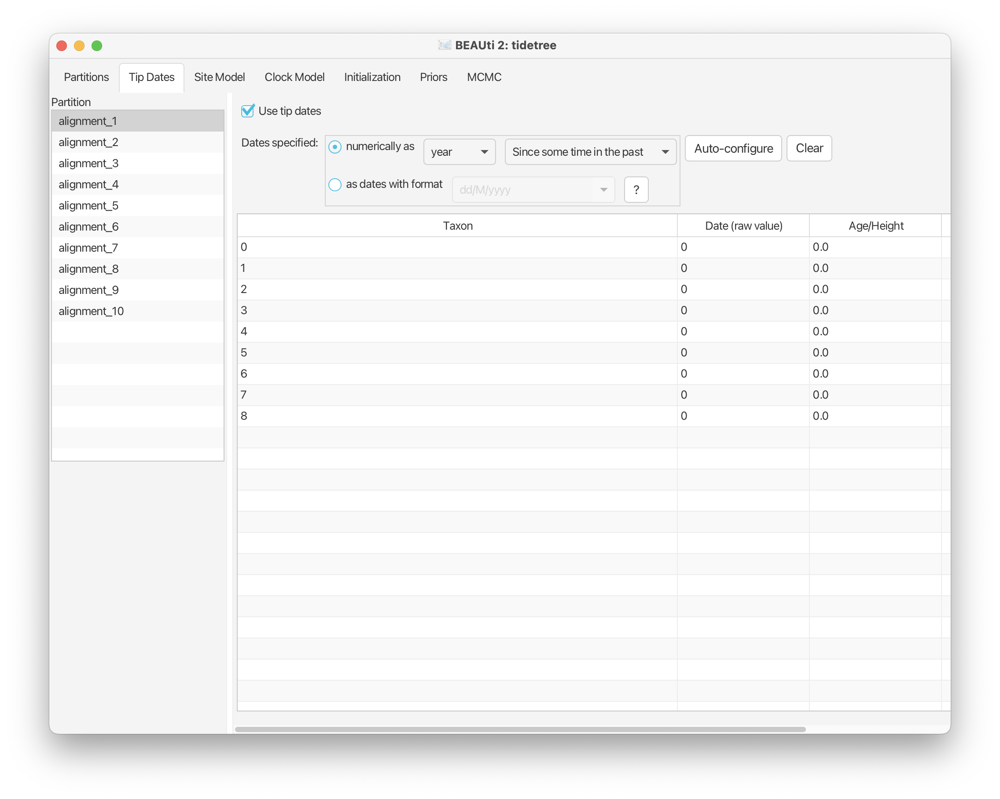
    <figcaption>Figure 7: Tip dates panel setup</figcaption>
</figure>

### Specifying the site model

Because a standard reversible substitution model (like a GTR or HKY model) is a poor description of the process that the lineage recorder uses to modify the target sites over time, TiDeTree uses a custom substitution model that is tailored to the lineage recording process .  

> Navigate to the **Site Model** tab. As you have loaded the TiDeTree template, BEAUti automatically provides you with the **TiDeTree Substitution Model**.
>
> We keep the **Gamma Category Count** set at **0**, which means that we are not modelling site heterogeneity. Further below, you can see the parameters of the substition model. The **Edit Rates** are initialised and set to be estimated. Based on the `.tidetree` files, BEAUti correctly detected that there are 2 edit outcomes and therefore initialised a vector with 2 elements.
>
> You’ll also see the **Silencing Rate** parameter, which models the possibility that certain barcode targets become progressively and irreversibly silenced—preventing their detection through single-cell RNA sequencing. In our dataset, no silencing was observed, so we set the value to **0.0** and uncheck the **estimate** box. Lastly, we set the **Edit Height** and **Edit Duration** to **54**, since editing was active for the entire duration of the experiment (54 hours).

Your site model tab should now look as in [Figure 8](#fig:substmodel).

<figure>
    
    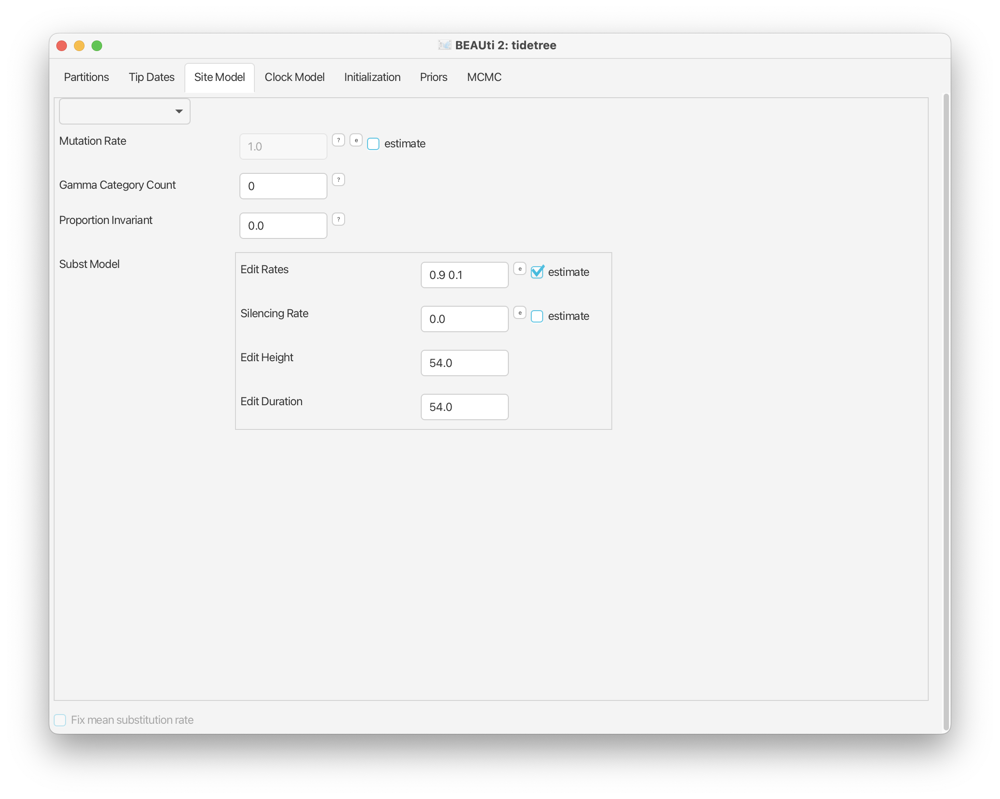
    <figcaption>Figure 8: Specifying the substitution model.</figcaption>
</figure>

> **Topic for discussion**
>
> Do we want to allow for variable edit rates? Why or why not?

### Setting the clock model

Now, we have to set the clock model. For this relatively short experiment, we assume that the rate of editing did not change. Thus, we keep the default strict clock model that assumes no branch rate variation. Since we linked clock models among trees all branches in all trees will have the same substitution rate.

> Navigate to the **Clock Model** tab. Verify that the **estimate** box is checked ([Figure 9](#fig:clock))

<figure>
    
    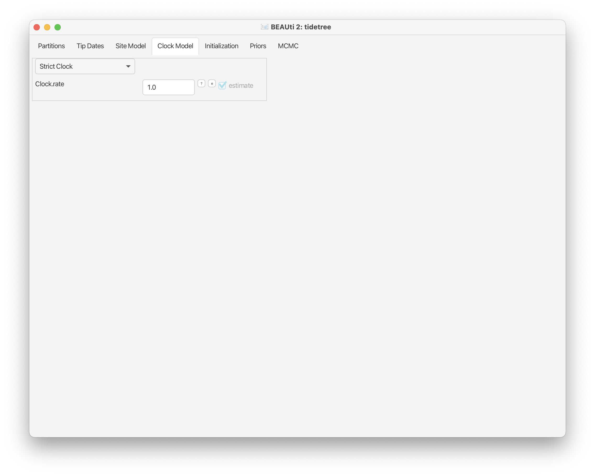
    <figcaption>Figure 9: Specifying the clock model.</figcaption>
</figure>

> **Topic for discussion**
>
> All our tips are sampled contemporaneously here. Why can we still estimate the clock rate?

### Setting initial values

Next, we come to the parameter initialization tab. Here, we will initialise the tree and experiment length for every alignment. This is also a great example of a step that’s much easier to edit directly in the XML file—consider this your gentle nudge to get comfortable with a bit of XML hacking! <i class="bi bi-emoji-wink"></i>

We'll initialise the tree using a custom starting tree class implemented within the TiDeTree package. The key idea is to ensure that the tree fits within the timeframe of the experiment and does not have a 0 likelihood. By setting the root height close to the total duration (e.g., 53 hours for a 54-hour experiment), and matching the editing height and editing duration, we ensure that the tree has a positive likelihood.

> Navigate to the **Initialization** tab. Now set the **Root Height**, **Edit Duration** and **Edit Height** to **53** for each of the 10 **Tree.t** parameters, representing the 10 alignments ([Figure 10](#fig:init-tree)). 

<figure>
    
    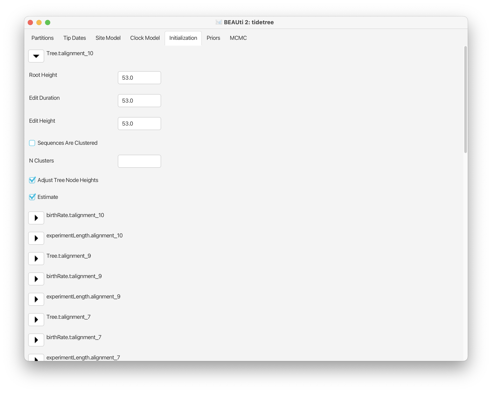
    <figcaption>Figure 10: Initialising the starting trees.</figcaption>
</figure>

> Further, we will set every **experimentLength** parameter to **54** hours and uncheck the **Estimate** box, because know _a priori_ how long each experiment was run and we do not want to estimate it ([Figure 11](#fig:init-experiment-length)).

<figure>
    
    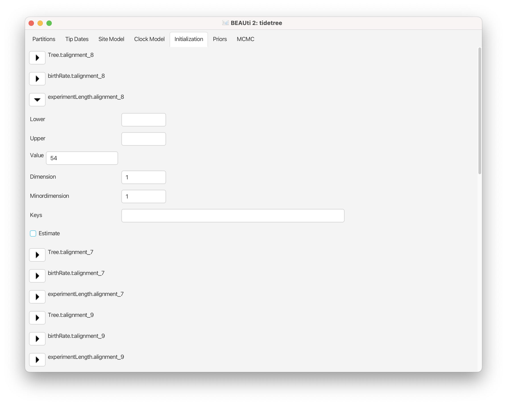
    <figcaption>Figure 11: Setting the experiment duration.</figcaption>
</figure>

### Setting priors
Now, we want to set the priors for the parameters of our model.

We'll start by choosing the phylodynamic model that describes how the trees were generated. Given the small size of the cell population (4 − 40 cells), we expect the population growth process to be highly stochastic. The birth-death-sampling model can account for these stochastic fluctuations.

In BEAUti, you'll notice that a separate prior is defined for every tree. Since all colonies were grown under the same experimental conditions, we want them to share the same birth and death rate parameters. Unfortunately, BEAUti doesn’t currently support linking these priors directly through the interface. So we will first create an XML file with separate parameters for each colony, and in a second step link the parameters by editing the XML file and see how the runs compare.

<!--figure>
    
    
    <figcaption>Figure 12:</figcaption>
</figure-->

> Navigate to the **Priors** tab. For each alignment, select **Birth-death model** from the drop-down menu. 
>
> Then, we specify the prior for the effective birth rate of the birth-death model (**BDBirthRate.t** for each of the alignments), which is the cell division rate minus the cell death rate. We select a **Uniform** prior over [0, 0.1]. This reflects our expectation that the total number of cells remain below 220 at the end of the experiment (after 54 h). 
> 
> For each **BDBirthRate.t** parameter ensure that the selected prior distribution is **Uniform** and set **Upper** to **0.1** ([Figure 12](#fig:birth-rate)).

<figure>
    
    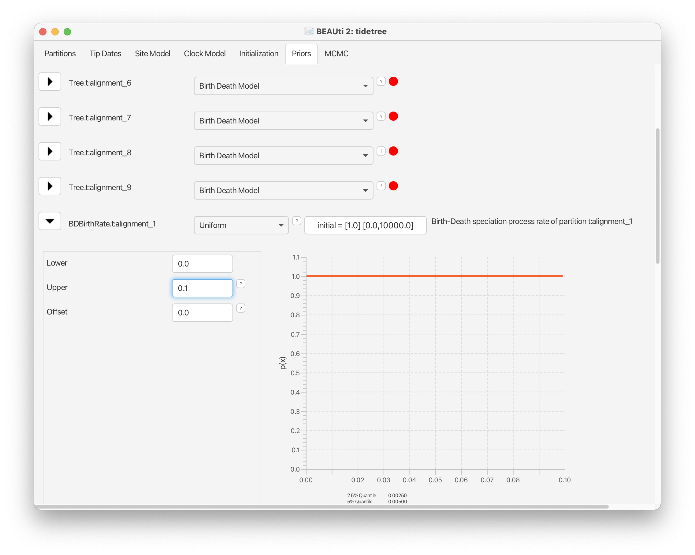
    <figcaption>Figure 12: Specifying the prior on the effective birth rate. </figcaption>
</figure>

Additionally, we also want to set the initial value of the effective birth rate to 0.05, such that it is contained within the prior distribution just set. 

> For each **BDBirthRate.t** parameter click on the initial value box and set **Value** to **0.05** ([Figure 13](#fig:init-birth-rate)).

<figure>
    
    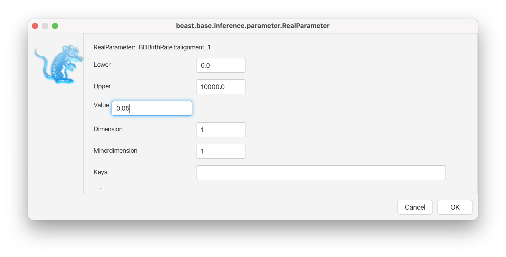
    <figcaption>Figure 13: Setting the initial value for the effective birth rate.</figcaption>
</figure>

Additionally, we place a Uniform prior over [0, 1] on the relative death rate or cell turnover (death rate / birth rate), stating that we expect the birth rate to be larger than the death rate. This should be the default prior, so we don't need to do anything ([Figure 14](#fig:death-rate)).

<figure>
    
    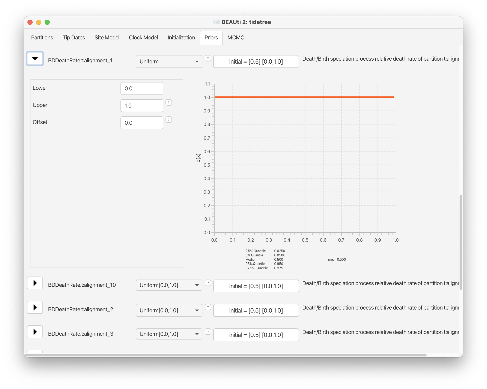
    <figcaption>Figure 14: The default prior on the relative death rate.</figcaption>
</figure>

Finally, we set a prior on the clock rate.

> Find the **clockRate.c** parameter and select **Log Normal** from the drop-down menu. Set the mean **M** to **-5** and the standard deviation **S** to **1** ([Figure 15](#fig:prior-clock)). 

This prior translates to us expecting between 1 to 10 edits to occur over 54 hours. We keep the default Dirichlet prior on the edit probabilities.

<figure>
    
    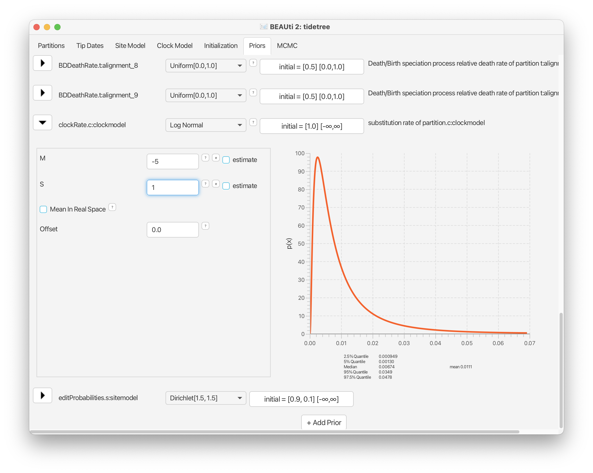
    <figcaption>Figure 15: Specifying the prior on the clock rate.</figcaption>
</figure>

<!--figure>
    Here's a snapshot of how your overall prior tab should now look like.

    
    
    <figcaption>Figure 13: Specify the prior on the edit probabilities.</figcaption>
</figure-->

> **Topic for discussion**
> 
> How do you expect the results to differ when birth and death rates are shared amonog alignments?
>

### MCMC

Before we can save our XML file we need to set up the MCMC chain and the output files.

> Navigate to the **MCMC** tab. Set the **Chain Length** to **5E6** (5 million). Reveal the options for **tracelog** and set **Log Every** to **1000**. Now do the same for each of the 10 **treelogs**. Additionally, make sure the tree logs are being written to separate files by renaming the **FileName** for each tree to `$(filebase).$(tree).trees` if that is not already the filename ([Figure 16](#fig:mcmc)).

<figure>
    
    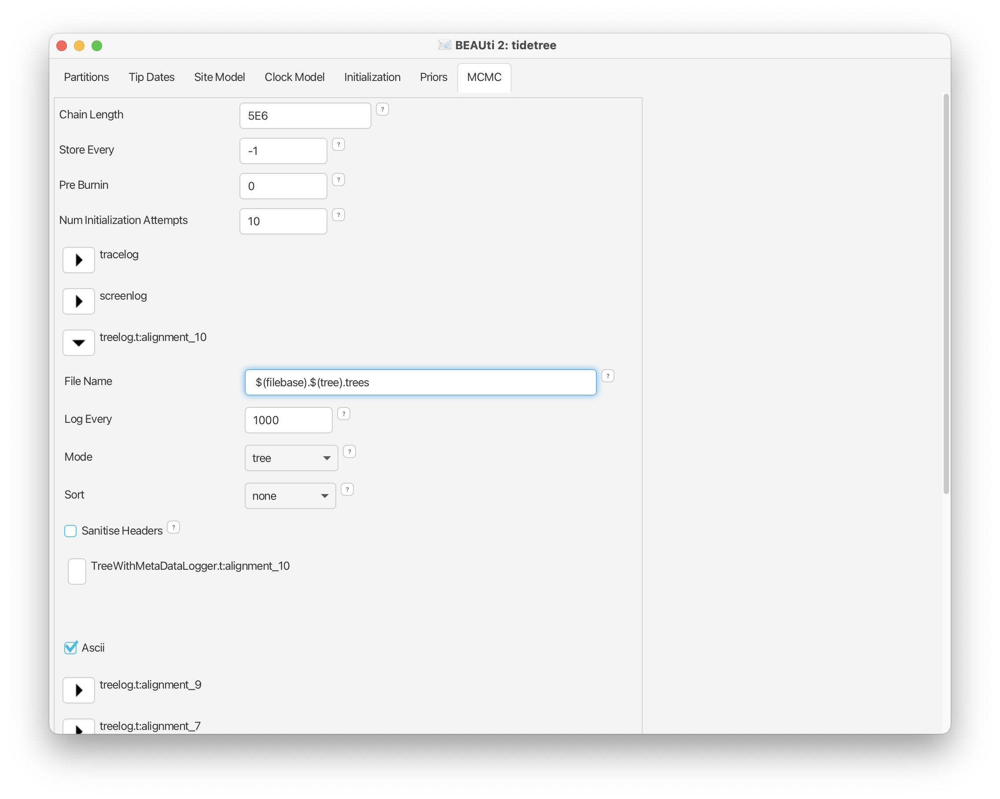
    <figcaption>Figure 16: Specifying distinct tree log file names.</figcaption>
</figure>

Now we are ready to save the XML file! 

> Once your analysis is fully set up, go to **File > Save**, navigate to your desired directory, and save the BEAST input file with a clear and descriptive name—e.g., `tidetree_tutorial.xml`.

<!--figure>
    
    
    <figcaption>Figure 14: MCMC setup.</figcaption>
</figure-->

 > **Tip:** 
 >
 > If BEAUti gives you trouble when generating the XML file and you’d like to proceed with the analysis right away, you can also download and use a pre-made XML file `tutorial-unlinked-birth-death.xml` from the left-hand panel.

----

## Running BEAST2

Now you are ready to start your BEAST2 analyses. 

> Execute your XML file in **BEAST2**. You should see the screen output every 1000 steps, reporting the likelihood and various other statistics.

----

## Analysing the data

### Unlinked analysis

We will use Tracer to examine convergence and look at parameter estimates. For this section you can either use the log file output from your BEAST2 run, or the _pre-cooked_ output files on the left-hand panel. 

> Load the file `tutorial-unlinked-birth-death.log` into **Tracer** to assess mixing and the parameter estimates. (Note that your own log file may be called something else). 

<figure>
    
    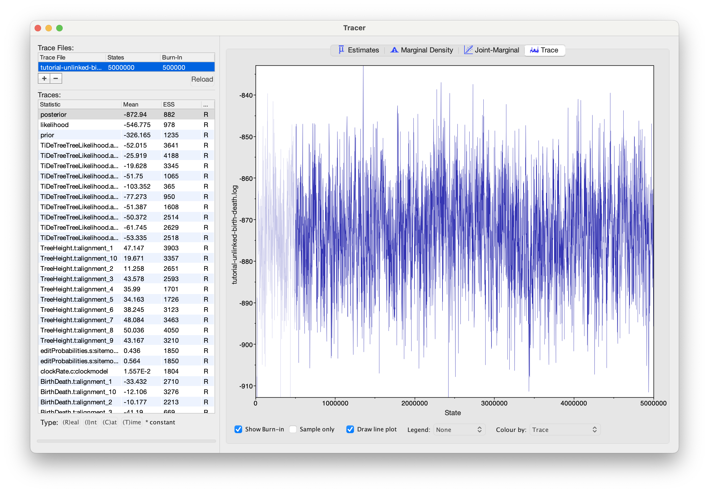
    <figcaption>Figure 17: Checking convergence for the unlinked analysis.</figcaption>
</figure>

All parameters, including the posterior and likelihood, show effective sample sizes (ESS) above 200, indicating good mixing ([Figure 17](#fig:tracer)).

Let's inspect the estimated clock rate, representing the rate of introducing an edit at any site in the barcode.

> In **Tracer**, select **clockRate** and then click on **Marginal Density** ([Figure 18](#fig:log-clock)).

<figure>
    
    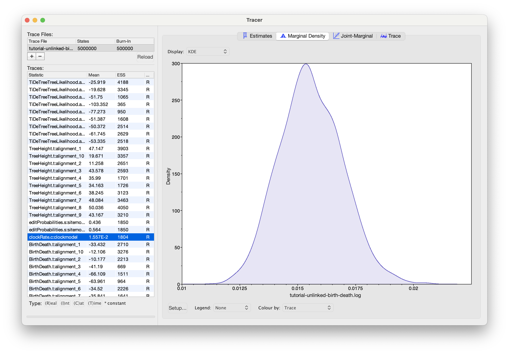
    <figcaption>Figure 18: Estimated clock rate (edit rate) marginal posterior.</figcaption>
</figure>

We see that the estimated median posterior rate is about 0.015 edits per site per hour. Over the 54-hour experiment, this corresponds to 0.8 expected edits per site. 

Now, let's examine the net growth rates (corresponding to the effective birth rates of the birth-death models) of each dataset.

> Select **BDBirthRate[1-10]** (select all 10 relative birth rates using **Shift+Click**) and then click on **Estimates**.

<figure>
    
    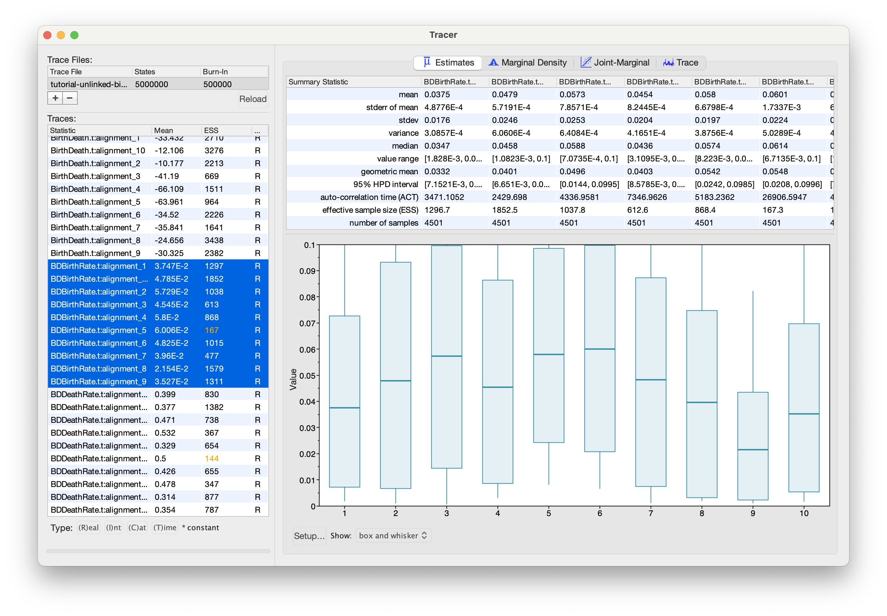
    <figcaption>Figure 19: Estimated net growth marginal posteriors.</figcaption>
</figure>

Most median estimates fluctuate around 0.04/hour ([Figure 19](#fig:unlinked-net-growth)), but the uncertainty is high—for example, the 95% highest posterior density (HPD) interval for alignment 1 ranges from [0.007 to 0.07].

## Linked analysis

Next, we compare the **unlinked** analysis to a **linked** analysis, where birth and death rates are shared across datasets. We have already prepared the XML file and its output for you (available on the left-hand panel). 

The key difference is that in our *unlinked* analysis, we estimated a separate birth and death rate for every dataset in every tree prior. In the *linked analysis*, we reference the same birth and death rates across tree priors, essentially pooling them across datasets which we show in the image below.

> **Note** 
> 
> To create the XML file for the unlinked analysis requires additional manual changes to the XML file, e.g., removing now-unnecessary parameter states, which we will not detail here. You’re welcome to explore the differences between the linked and unlinked XML files ([Figure 20](#fig:xml)).

<figure>
    
    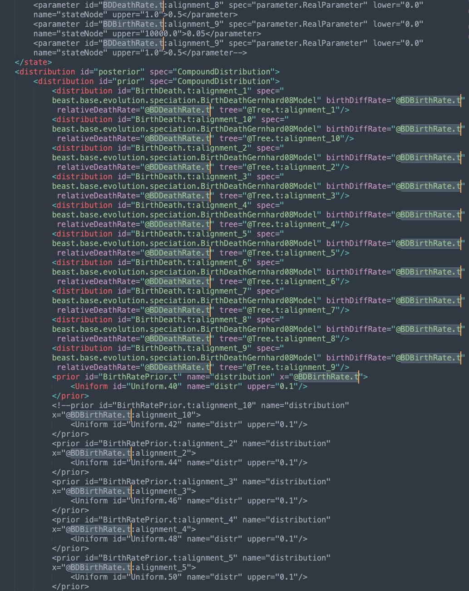
    <figcaption>Figure 20: XML hacking to pool birth and death rates across datasets.</figcaption>
</figure>

> Load the file `tutorial-linked-birth-death.log` into **Tracer**. 
> (Feel free to also run `tutorial-linked-birth-death.xml` and produce your own log and trees files).

We can see that all ESS values are above 200 and that the Traces look well mixed, indicating convergence ([Figure 21](#fig:linked-traces)).

<figure>
    
    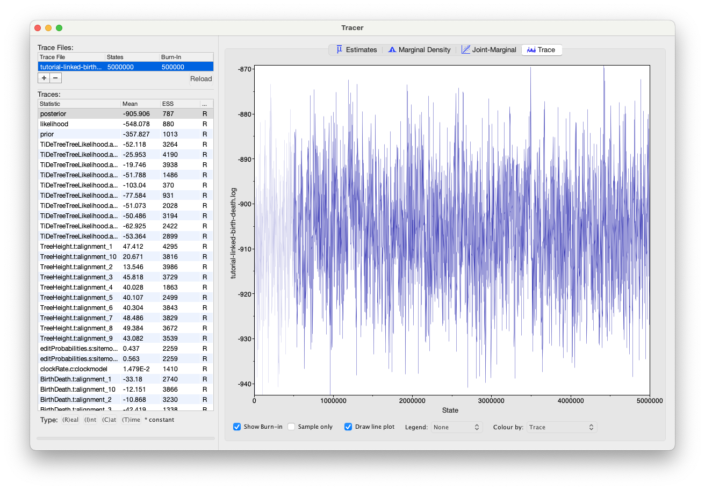
    <figcaption>Figure 21: Checking convergence for the linked analysis.</figcaption>
</figure>

Let us now check how the estimated net growth rates compare to the unlinked analysis.

> Select on **BDBirthRate.t:alignment_1** and and then click on **Estimates**. Note that because the relative birth rates are linked we only have one parameter in the log file. 

<figure>
    
    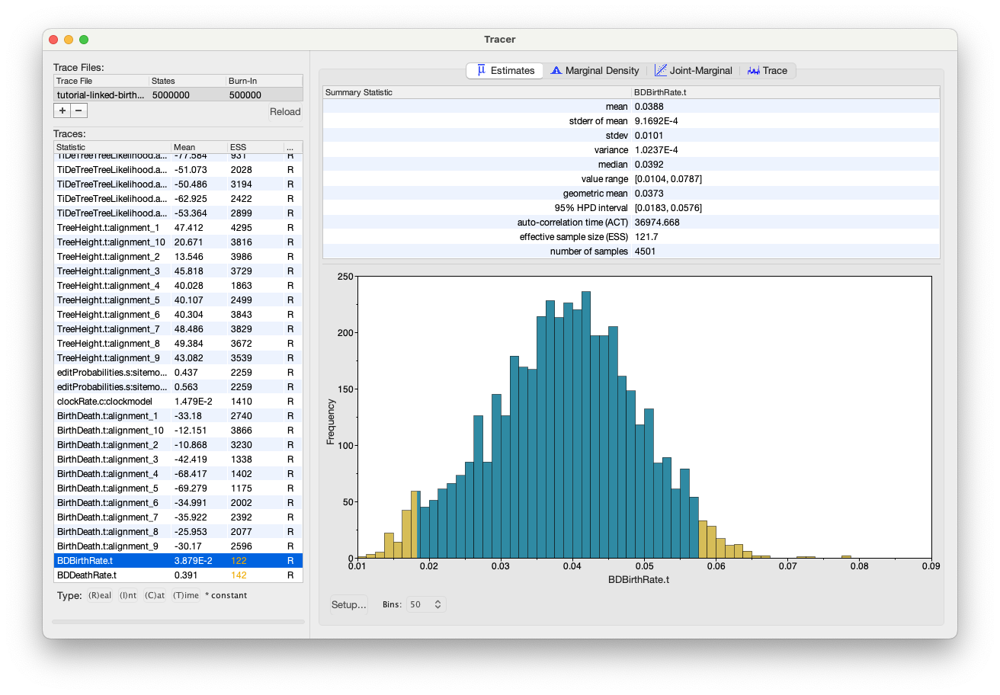
    <figcaption>Figure 22: Estimated net growth marginal posteriors pooled across alignments.</figcaption>
</figure>

We observe that the uncertainty is reduced, and the 95% HPD interval for the pooled **effective birth rate** is now **[0.02, 0.06]**, which corresponds to **at least 1–4 cell divisions** over the course of the experiment ([Figure 22](#fig:linked-net-growth)). The *“at least”* reflects that the effective birth rate equals the birth rate minus the death rate, providing a **lower bound** on the total number of cell divisions. This estimate aligns well with the original publication’s reported range of **3–5 divisions**.

In summary, even though the individual dataset carried limited signal, pooling parameters across alignments allows us to  extract biologically meaningful estimates with reduced uncertainty.

----

## Tree log visualisation

Next, we want to visualise the trees. Be aware that how much sense it makes to look at the trees depends on the dataset and very much on the number of sites that are used to trace lineages and how large the tree is that you are trying to estimate (the general data points vs number of parameters question). Remember, in every dataset here we have _only_ 10 sites, which is a much smaller signal compared to the thousands of sites commonly used in applications in epidemiology or macroevolution.

Let us pick dataset 1, which has 9 cells, to visualise. To appreciate how much uncertainty there is in the tree structure, lets plot the tree posterior in Densitree.

> Open **DensiTree** and load the file `tutorial-linked-birth-death.1.trees`

<figure>
    <!--a id="fig:download"></a-->
    
    <figcaption>Figure 23: Posterior distribution of trees for dataset 1 in the linked analysis.</figcaption>
</figure>

You can see that the cherry for cells 6 and 7 is well supported whereas the hierarchy among cells 0-3 has multiple consensus trees that can explain the data.

To summarise the posterior trees, we will use TreeAnnotator and generate two point estimates, as you have seen in other tutorials, the maximum clade credibility tree (MCC) and a tree based on the conditional clade distribution (CCD). **To save time, you may run just one method and compare it to the other using the example below.**

### Generating the MCC tree

> Open **TreeAnnotator** and then set the options as in [Figure 24](#fig:ta-mcc) below. You have to specify the **Burn in percentage**, **Target tree type, Node heights, Input Tree File** and the **Output File**. 
>
> Click **Run** to start the program.

<figure>
    
    
    <figcaption>Figure 24: TreeAnnotator settings for generating the MCC tree.</figcaption>
</figure>

### Generating the CCD tree

> Open **TreeAnnotator** and then set the options as in [Figure 25](#fig:ta-ccd) below. Compared to generting the MCC tree you only have to change the **Target tree type** and the name of the  **Output file**. All other options remain the same. 
>
> Click **Run** to start the program.

<figure>
    
    
    <figcaption>Figure 25: TreeAnnotator settings for generating the CCD tree.</figcaption>
</figure>

### Analysing the summary trees

> Open **FigTree** and load your chosen summary tree.
>
> On the left hand menu, select **Node Labels** and choose to display the **posterior** support at the internal nodes. Increase the font size until the labels are clearly visible.
>
> Further, select **Node Bars** and display **height_95%_HPD** to display the 95% HPD for the node heights.
>

<figure>
    <!--a id="fig:ta-ccd"></a-->
    
    <figcaption>Figure 26: The CCD tree displayed in FigTree.</figcaption>
</figure>

> **Topic for discussion** 
>
> How do the posterior node labels compare to the observations we made when analysing the tree posterior in DensiTree?

----

# Useful Links

- [Bayesian Evolutionary Analysis with BEAST 2](http://www.beast2.org/book.html) 
- BEAST 2 website and documentation: [http://www.beast2.org/](http://www.beast2.org/)
- Join the BEAST user discussion: [http://groups.google.com/group/beast-users](http://groups.google.com/group/beast-users) 

----

# Relevant References


